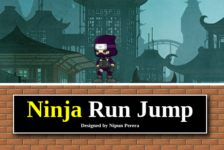

# NINJA RUN JUMP



<p>This mini game was created using HTML,CSS and JavaScript. The purpose of this project was to learn JavaScript and learn about Event Handling using keyboard keys.

The charactor only ables to run both left and right sides and ables to jump.

<strong>CONTROLS : RIGHT ARROW | LEFT ARROW | SPACE</strong>
</p>

## Built with using

* HTML 5 
* CSS 3 
* JavaScript 
 
 


## How to use this repository

* Open the terminal
* Then clone the repo using 
```
git clone https://github.com/nipunsperera/mini-game-js.git
```


<!-- CONTACT -->
## Contact

Nipun Perera - [@LinkedIn](https://www.linkedin.com/in/nipunperera96/)

Project Link: [https://github.com/nipunsperera/mini-game-js.git](https://github.com/nipunsperera/mini-game-js.git)
